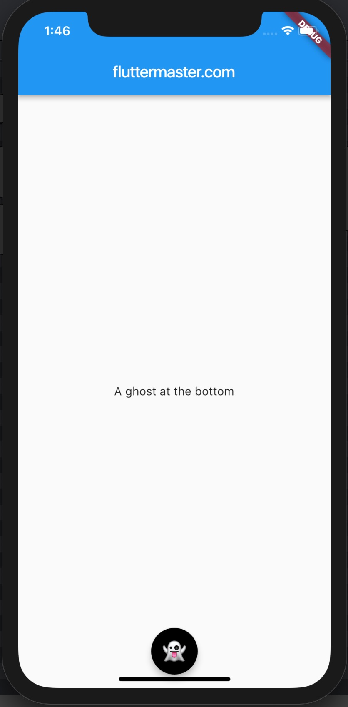

# Make cute floating ghost in Flutter


**Cute ghost**



```dart
floatingActionButton: FloatingActionButton(
  onPressed: () => print('Clicked'),
  foregroundColor: Colors.white,
  backgroundColor: Colors.black,
  child: Text(
    '👻',
    style: TextStyle(fontSize: 28.0),
  ),
),
floatingActionButtonLocation: FloatingActionButtonLocation.centerFloat,
```
